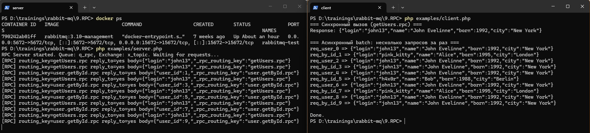

# RPC-библиотека для RabbitMQ (PHP)

Реализация RPC-клиента и RPC-сервера поверх RabbitMQ: запрос отправляется в обменник с `routing_key`, ответ приходит в очередь `reply_to` с тем же `correlation_id`.

---

## Зачем RPC в RabbitMQ

### Что делает обычный RabbitMQ

- **Обычный сценарий**: продюсер отправил сообщение → брокер положил его в очередь → какой‑то консьюмер его прочитал, обработал и всё.
- Для брокера это **односторонний поток**: он не знает, что нужно кому‑то «ответить», он просто доставляет сообщения по правилам (`direct`, `topic`, `fanout`, `headers` и т.д.).

### Что добавляет RPC-паттерн

RPC — это **договорённость между клиентом и сервером поверх RabbitMQ**, которая позволяет эмулировать:

> «Сделай что‑то на удалённом сервисе и верни мне результат».

Для этого:

- **Клиент**: отправляет запрос в обменник с нужным `routing_key`, в свойствах сообщения указывает `reply_to` (очередь, куда ждать ответ) и `correlation_id` (уникальный id запроса, чтобы отличать ответы).
- **Сервер**: получает сообщение из своей очереди, выполняет действие, отправляет ответ через default exchange (`''`) в очередь `reply_to`, копирует `correlation_id` из запроса в ответ.

Клиент, слушая свою очередь ответов, по `correlation_id` понимает: «Это ответ на вот тот конкретный запрос».

### Вывод

- RPC поверх RabbitMQ нужен, чтобы реализовать **двустороннее взаимодействие: запрос → ответ** и **получить результат выполнения действия на сервере** (а не только отправь и забудь»).
- Сам RabbitMQ **из коробки не знает про «ответы»**, он только пересылает сообщения. Весь RPC реализуется на уровне приложения с помощью `reply_to` + `correlation_id` и согласованного протокола между клиентом и сервером.

---

## Требования

- PHP 7.4+
- Расширение **ext-sockets** (см. ниже)
- RabbitMQ (например образ `rabbitmq:3.10-management` в Docker)

### Зачем нужно расширение ext-sockets

**ext-sockets** даёт в PHP доступ к BSD‑сокетам (TCP/UDP). Библиотека **php-amqplib** может работать двумя способами:

- **StreamIO** — через встроенные потоки PHP (`stream_socket_*`), **расширение sockets не требуется**.
- **SocketIO** — через расширение sockets (если оно включено).

По умолчанию обычно используется StreamIO, поэтому при выключенном `extension=sockets` соединение с RabbitMQ и RPC часто работают. Включение sockets нужно для соответствия требованиям php-amqplib и на случай использования SocketIO.

Чтобы включить `ext-sockets`:

- найдите активный `php.ini` (команда `php --ini` в терминале покажет путь);
- раскомментируйте строку:
  ```ini
  extension=sockets
  ```
- перезапустите PHP/FPM/веб‑сервер (если используете не CLI).

## Установка

1. Установите **PHP 7.4+** и **Composer**.
2. Склонируйте репозиторий или скопируйте каталог `project_dir` к себе в проект.
3. В терминале перейдите в корень библиотеки и установите зависимости:

   ```bash
   cd path/to/project_dir
   composer install
   ```

   Если в системе не включено расширение sockets, временно можно установить зависимости так:

   ```bash
   composer install --ignore-platform-reqs
   ```

---

## Как проверить работу библиотеки (у вас уже запущен RabbitMQ в Docker)

У вас контейнер `rabbitmq-test` с пробросами портов **5672** (AMQP) и **15672** (Management). Этого достаточно.

### Шаг 1. Убедиться, что RabbitMQ доступен

- В браузере откройте: **http://localhost:15672**
- Логин: `guest`, пароль: `guest`
- Если страница открывается — брокер доступен с хоста

### Шаг 2. Запустить RPC-сервер

Откройте **первый** терминал в корне библиотеки (`project_dir`):

```bash
cd path/to/project_dir
php examples/server.php
```

Должно появиться:

```
RPC Server started. Queue: q_rpc, Exchange: x_topic. Waiting for requests...
```

Окно не закрывайте — сервер ждёт запросы.

### Шаг 3. Запустить RPC-клиент

Откройте **второй** терминал (в той же папке):

```bash
cd path/to/project_dir
php examples/client.php
```

Ожидаемый вывод:

```
=== Синхронный вызов (getUsers.rpc) ===
Response: {"login":"john13","name":"John Evelinne","born":1992,"city":"New York"}

=== Асинхронный batch: несколько запросов за раз ===
getUsers.rpc => {"login":"john13","name":"John Evelinne",...}
user.getById.rpc => {"login":"john13",...}
getUsers.rpc => {"login":"pink_kitty","name":"Alice",...}

Done.
```

В первом терминале (сервер) при этом появятся логи обработки сообщений.

### Шаг 4. Посмотреть объекты в RabbitMQ (по желанию)

В Management UI (http://localhost:15672):

- **Exchanges** — появится обменник `x_topic` (type: topic)
- **Queues** — очередь `q_rpc` (с привязкой к `x_topic` по ключу `*.rpc`), плюс временные очереди для ответов клиенту (amq.gen-...)

После успешного прогона клиента вы увидите, что сообщения обработаны, очереди могут быть пустыми (сообщения потреблены).

### Если что-то пошло не так

| Симптом | Что проверить |
|--------|----------------|
| `Connection refused` / таймаут | Контейнер запущен? `docker ps` — должен быть `rabbitmq-test` на 5672, 15672 |
| `ext-sockets` missing | Установить: `composer install --ignore-platform-reqs` или включить `extension=sockets` в php.ini |
| Клиент висит или "Timeout" | Сначала запущен сервер? Он должен быть запущен до клиента |
| Ошибка "exchange not found" | Сначала запустите сервер — он создаёт обменник `x_topic` и очередь `q_rpc` |

---

## Как использовать библиотеку (подробно)

### Общая схема

1. **Сервер** слушает одну очередь (например `q_rpc`), привязанную к обменнику (например `x_topic`). Для каждого типа запроса регистрируется обработчик по **routing key** (например `getUsers.rpc`, `user.getById.rpc`).
2. **Клиент** публикует запрос в обменник с нужным `routing_key`, в свойствах сообщения указывает `reply_to` (очередь для ответа) и `correlation_id` (уникальный id запроса).
3. Сервер обрабатывает запрос, кладёт ответ в default exchange с `routing_key = reply_to` и тем же `correlation_id`. Клиент получает ответ в своей очереди и сопоставляет его с запросом по `correlation_id`.

Сериализация: запросы и ответы по умолчанию в **JSON**.

---

### Использование RPC-сервера

#### 1. Подключение и очередь

```php
use Rpc\RpcServer;

$server = new RpcServer(
    'localhost',  // хост
    5672,         // порт AMQP
    'guest',      // пользователь
    'guest',      // пароль
    'q_rpc'       // имя очереди, в которую будут приходить запросы
);
```

Очередь `q_rpc` будет создана при первом запуске (если не существует).

#### 2. Привязка к обменнику

Запросы клиент шлёт в **обменник**, а не в очередь. Нужно привязать очередь к обменнику, чтобы сообщения с обменника попадали в эту очередь.

```php
// Один ключ привязки (topic): все ключи вида "что-то.rpc" попадут в очередь
$server->bindExchange('x_topic', '*.rpc');

// Или несколько ключей
$server->bindExchange('x_topic', ['getUsers.rpc', 'user.getById.rpc']);

// Или всё подряд (осторожно в проде)
$server->bindExchange('x_topic', '#');
```

Третий параметр — тип обменника (`'topic'`, `'direct'`, `'fanout'`). По умолчанию `'topic'`.

#### 3. Регистрация обработчиков

Каждый **routing_key** — это по сути "метод RPC". Обработчик получает тело запроса (уже распарсенный массив, если пришёл JSON) и возвращает ответ (массив/объект будет сериализован в JSON, строка уйдёт как есть).

```php
$server->handle('getUsers.rpc', function ($payload) {
    $login = $payload['login'] ?? '';
    // ... поиск пользователя ...
    return ['login' => $login, 'name' => 'John', 'born' => 1992];
});

$server->handle('user.getById.rpc', function ($payload) {
    $id = (int)($payload['user_id'] ?? 0);
    // ... поиск по id ...
    return ['user_id' => $id, 'full_name' => '...'];
});
```

Если по данному `routing_key` обработчика нет, сервер всё равно отправит ответ — телом будет исходное тело запроса (эхо). Ошибки в обработчике можно ловить и возвращать, например, `['error' => $e->getMessage()]`.

#### 4. Запуск цикла

```php
$server->run();  // блокирующий цикл, обрабатывает сообщения до остановки (Ctrl+C)
```

Перед этим можно зарегистрировать несколько `handle(...)`. Порядок вызовов не важен.

---

### Использование RPC-клиента

#### 1. Подключение

```php
use Rpc\RpcClient;

$client = new RpcClient(
    'localhost',
    5672,
    'guest',
    'guest'
    // опционально 5-й аргумент: vhost, по умолчанию '/'
);
```

При создании клиент сразу подключается к RabbitMQ и создаёт **временную эксклюзивную очередь** для ответов (её имя подставляется в `reply_to`).

#### 2. Таймаут (по желанию)

По умолчанию ожидание ответа — 30 секунд. Можно изменить:

```php
$client->setTimeout(10.0);  // 10 секунд
```

#### 3. Синхронный вызов (один запрос — один ответ)

```php
$response = $client->call(
    'x_topic',           // обменник
    'getUsers.rpc',      // routing_key (тип запроса)
    ['login' => 'john13'] // тело запроса (массив или строка; массив уйдёт как JSON)
);

// $response — строка (тело ответа, обычно JSON)
$data = json_decode($response, true);
```

Если ответ не пришёл за время таймаута, вернётся пустая строка (и часть ответов в batch может быть пустой).

#### 4. Batch-вызов — несколько запросов за раз (callBatch)

Отправляются несколько запросов с разными (или одинаковыми) `routing_key`. **Сопоставление делается по ID запроса**, а не по routing_key.

```php
$results = $client->callBatch('x_topic', [
    'req_get_user' => [
        'routing_key' => 'getUsers.rpc',
        'body'        => ['login' => 'john13'],
    ],
    'req_get_by_id' => [
        'routing_key' => 'user.getById.rpc',
        'body'        => ['user_id' => 1],
    ],
]);

// $results['req_get_user']  — ответ на первый запрос
// $results['req_get_by_id'] — ответ на второй запрос
```

ID (`req_get_user`, `req_get_by_id`) — это любые уникальные строки на стороне клиента.

#### 5. Закрытие соединения

```php
$client->close();
```

---

## Краткая шпаргалка по API

| Действие | Код |
|----------|-----|
| Создать сервер | `new RpcServer($host, $port, $user, $pass, $queueName)` |
| Привязать очередь к обменнику | `$server->bindExchange('x_topic', '*.rpc')` |
| Добавить обработчик | `$server->handle('getUsers.rpc', function ($payload) { return [...] })` |
| Запустить сервер | `$server->run()` |
| Создать клиент | `new RpcClient($host, $port, $user, $pass)` |
| Таймаут | `$client->setTimeout(10.0)` |
| Один запрос | `$client->call('x_topic', 'getUsers.rpc', ['login' => 'john13'])` |
| Несколько запросов | `$client->callBatch('x_topic', ['req1' => ['routing_key' => '...', 'body' => [...]], ...])` |
| Закрыть клиент | `$client->close()` |

---

## Примеры в репозитории

В папке `examples/`:

- **server.php** — сервер с двумя методами: `getUsers.rpc` (пользователь по логину) и `user.getById.rpc` (по индексу). Запуск: `php examples/server.php`.
- **client.php** — один синхронный вызов и batch из нескольких запросов (10 штук) с разными routing_key. Запуск: `php examples/client.php`.

Порядок: сначала запустить сервер, затем клиент. Обменник и очередь создаёт сервер при первом запуске.

### Пример вывода в терминале



---

## Про настоящую асинхронность в PHP и наш подход

В “классическом” PHP (CLI/FPM) **нет встроенного `async/await` и стандартного event-loop**, как в Python (`asyncio`) или JS. Настоящая асинхронность обычно делается с помощью сторонних библиотек:

- **Amphp** (`amphp/amp`) — корутины на базе генераторов + свой event-loop.
- **ReactPHP** — event-loop, неблокирующие сокеты и промисы.
- **Swoole / OpenSwoole** — расширение, добавляющее корутины и async‑сокеты прямо в PHP.

На базе этих инструментов можно построить “честный” Async RPC‑клиент:

- один long‑living event-loop;
- одно подключение к RabbitMQ и один consumer для очереди ответов;
- для каждого RPC‑вызова — `Promise/Deferred`, хранящийся в мапе `correlation_id → promise`;
- callback у `basic_consume` по приходу сообщения резолвит соответствующий promise;
- пользовательский код выглядит как `await rpc.execute(...);` (или `yield` в Amphp).

В этой учебной библиотеке мы выбрали **упрощённый подход без сторонних async‑фреймворков**:

- `RpcClient::call()` — **синхронный вызов** (один запрос → один ответ), блокирующий до получения ответа или таймаута.
- `RpcClient::callBatch()` — **batch-вызов**:
  - клиент последовательно отправляет N сообщений;
  - для каждого сообщения устанавливается свой `correlation_id` и ID запроса;
  - клиент блокирующим циклом `wait()` собирает ответы и сопоставляет их с запросами по `correlation_id`;
  - снаружи это выглядит как “асинхронный стиль” (несколько запросов и ответы в любом порядке), но реализация остаётся **однопоточной и блокирующей**.

Такой подход:

- хорошо показывает **идею RPC поверх RabbitMQ** и работу `reply_to`/`correlation_id`;
- остаётся простым для запуска в любом окружении с обычным PHP;
- может быть эволюционирован до “настоящего async” при желании, если заменить внутреннюю реализацию клиента на Amphp/ReactPHP, сохранив API (`call`, `callBatch`).

---

## Структура проекта

- `src/RpcClient.php` — RPC-клиент (sync + batch).
- `src/RpcServer.php` — RPC-сервер с обработчиками по `routing_key`.
- `examples/server.php`, `examples/client.php` — готовые примеры.
- Сериализация запросов/ответов — JSON.
